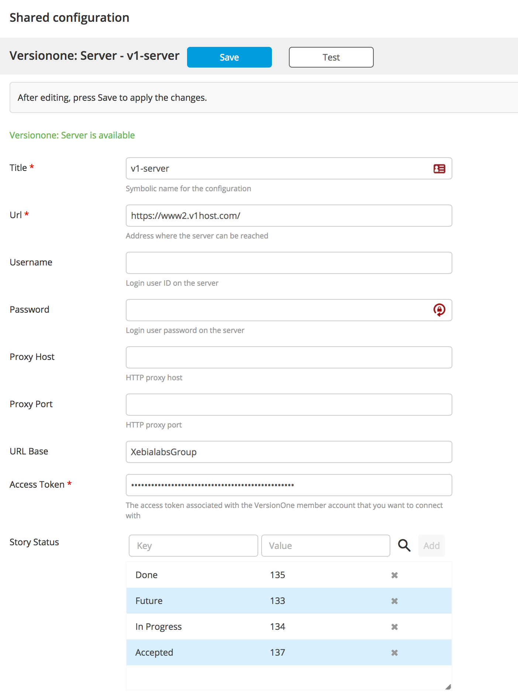
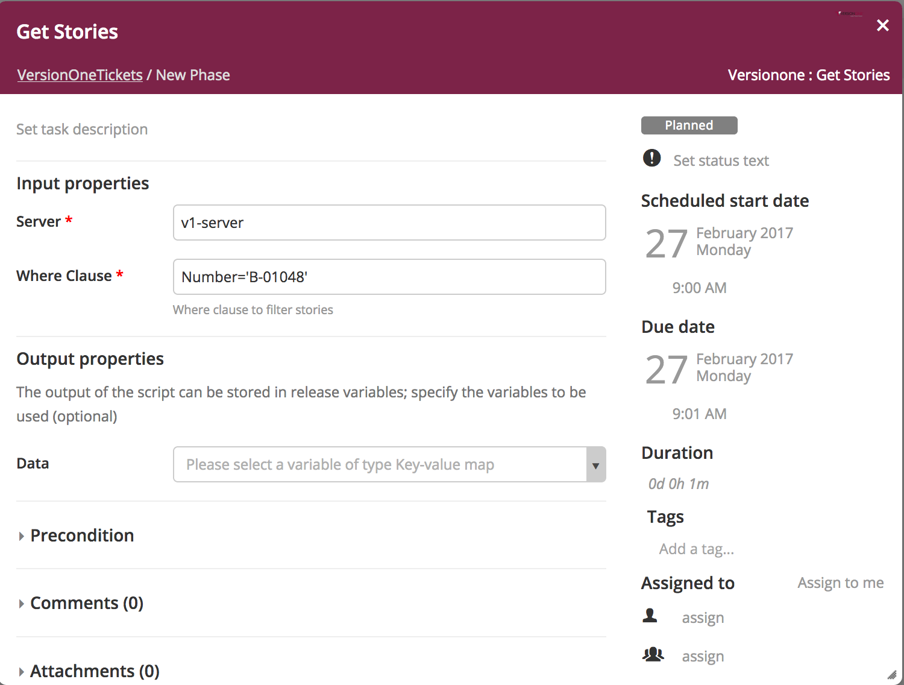
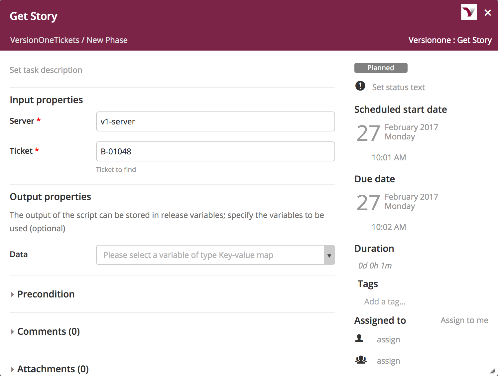
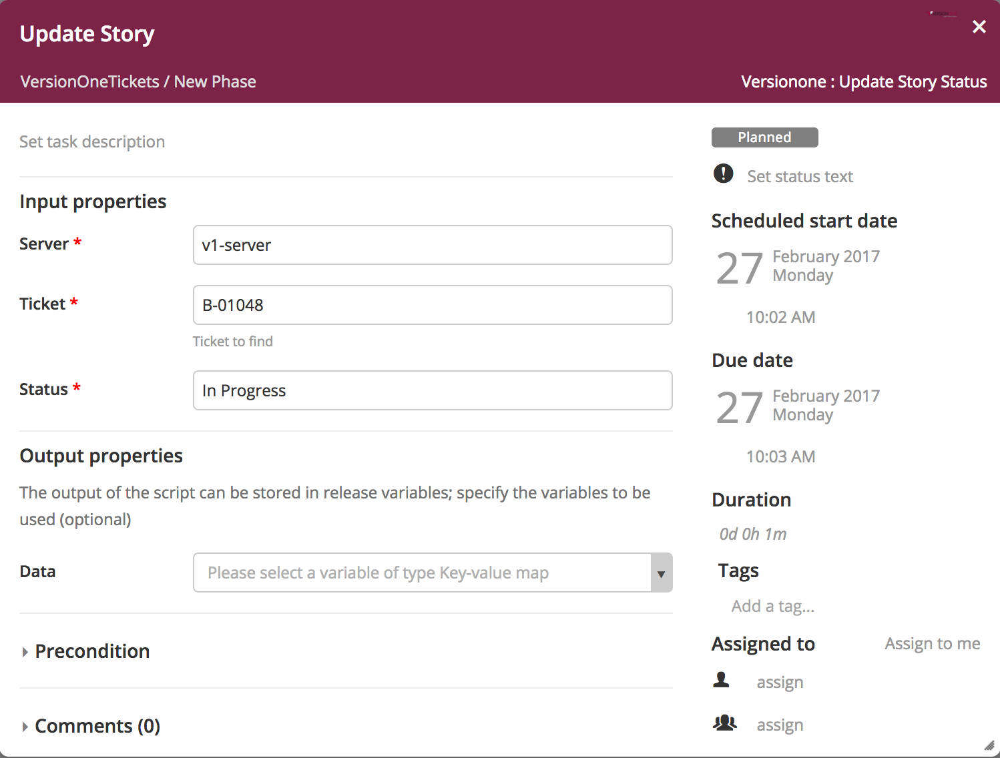

# Preface #

This document describes the functionality provided by the xlr-versionone-plugin.

See the **XL Release Reference Manual** for background information on XL Release and release concepts.

# Overview #

## Requirements ##

* From version 1.0.1+: XLR 4.8.0+

## Installation ##

* Define an Access Token using the VersionOne UI: Go to `Configuration - Applications` and add a new Application with name `XLRelease`. Use `Access Token` as an authentication mechanism.
* Place the versionone plugin into plugins
* Place the versionone java sdk into plugins (download from [Fixes V1Connector](https://github.com/jdewinne/VersionOne.SDK.Java.APIClient)). A [pull request](https://github.com/versionone/VersionOne.SDK.Java.APIClient/pull/21) has been send, as the official sdk can't handle properly failing requests.

## Types ##

+ CreateIssue
    * `assetType`: For a list of possible values, see [Asset Types](https://community.versionone.com/Developers/Developer-Library/Concepts/Asset_Type)
    * `projectId`: The oid of the project you want to create the issue for, f.e. Scope:1535
    * `attributes`: Map of key / value pairs
    * `token`: output property - Output token which is the oid reference

## Testing / Building ##

`./gradlew clean assemble`

And copy the `jar` from `build/libs` into your plugins folder.

## Server Configuration

You need to create a *Shared Configuration* for you **Version One Server**.  The *Shared Configuration* will have the information to connect to you **Version One Server** in addition to some mappings for the underlying indexes in **Version One** to Story Statuses.

## Release Tasks

### Create Issue
This task allows you to create new issues in **Version One**

### Get Stories
This task allows you to get a list of the stories available in **Version One** based on a query.  There are several exampes of queries available on the **Verson One** site.  For details of the **Version One** query language 

### Get Story
Only one story is returned for this task.  Details of the story will be contained in the **Data** field

### Update Story Status
Using the key words in the server configuration you can update the story status.

---

## References

1. [www.versionone.com](https://www.versionone.com/)
2. [community.versionone.com](https://community.versionone.com/)
3. [VersionOne.SDK.Java.APIClient](http://versionone.github.io/VersionOne.SDK.Java.APIClient/)
4. [Version One Sample Code](https://community.versionone.com/VersionOne_Connect/Developer_Library/Sample_Code)
5. [REST APIs walkthrough](https://github.com/versionone/api-examples/blob/master/rest/apis-walkthrough.md)

